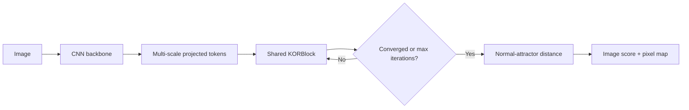

# KORNet

**Kaprekar-Inspired Recursive Opposing-Ranking Network for Automated Visual Quality Inspection**

KORNet is an experimental one-class visual-anomaly architecture. It asks whether a shared recursive operator, inspired by the opposing orderings in Kaprekar's 6174 routine, can improve the accuracy–efficiency tradeoff of industrial defect detection. It does **not** push representations toward the number 6174, and this repository makes no state-of-the-art claim.

> **KORNet is an experimental research architecture. Performance claims must be supported by reproducible benchmark results.**

## Method

For token features \(X_t\in\mathbb{R}^{B\times N\times D}\), each ranking head learns scores, creates differentiable descending and ascending permutation relaxations, and forms an opposing difference:

\[
D_t^{(h)} = P_{\downarrow}^{(h)}X_t-P_{\uparrow}^{(h)}X_t,
\qquad
X_{t+1}=\mathrm{LayerNorm}\left(X_t+g_t\Phi(D_t)\right).
\]

The same `KORBlock` parameters are reused at every iteration. At inference, a sample may stop when

\[
\delta_t=\frac{\lVert X_{t+1}-X_t\rVert_2}{\lVert X_t\rVert_2+\epsilon}
\]

remains below a configurable threshold. Training uses a fixed unroll by default for stable gradients. The score exposes three independently ablatable signals: distance from the normal prototype, recursive dynamics, and opposing-ranking magnitude.



The soft training path uses NeuralSort and costs \(O(BHN^2)\). `max_tokens` makes that expense explicit and bounded. The hard deployment path uses `torch.argsort`. Multi-scale maps are reconstructed independently and averaged at input resolution.

The optimized configuration adds a normal-only spatial-statistics head. It keeps an EMA mean and diagonal variance for each token location, blends the recursive representation with the initial CNN representation, and pools the highest-scoring token fraction for image detection. This preserves the backbone signal while allowing opposing-ranking recursion to contribute. No anomalous image or mask is used to fit these statistics.

## Install

Python 3.10+ is required. CUDA or Apple Metal (MPS) is used automatically when available.

```bash
python -m venv .venv
source .venv/bin/activate
pip install -e '.[app,research,export,dev]'
pytest
```

For a minimal training environment, use `pip install -r requirements.txt`. For an exact full development/research environment, use `pip install -r requirements.lock`; regenerate it with `uv pip compile pyproject.toml --all-extras -o requirements.lock` when dependencies change.

## Datasets and leakage policy

KORNet trains on **normal training images only**. The loader creates a deterministic held-out normal validation split. This validation split calibrates anomaly thresholds and hyperparameters. Test anomalies are read only by final evaluation.

Dataset downloads are not automated because users must review the current license/terms at each official source.

```bash
python scripts/prepare_mvtec.py
python scripts/prepare_visa.py
python scripts/prepare_mvtec_ad2.py
```

Expected MVTec AD structure:

```text
data/mvtec/bottle/
├── train/good/*.png
├── test/good/*.png
├── test/<defect>/*.png
└── ground_truth/<defect>/*_mask.png
```

VisA accepts the official `split_csv/1cls.csv` layout. MVTec AD 2 accepts its official `train/good`, `test` or `test_public` hierarchy. Private MVTec AD 2 test labels must not be used for calibration or model selection.

## Commands

Train one category:

```bash
python train.py --config configs/kornet_mvtec.yaml
python train.py --config configs/kornet_mvtec_optimized.yaml
python train.py --config configs/kornet_mvtec.yaml --category cable --seed 123
python train.py --config configs/kornet_mvtec.yaml --resume runs/kornet_mvtec_bottle/seed_42/last.pt
```

Train all categories with the default three seeds (42, 123, 456):

```bash
python scripts/train_all_categories.py --config configs/kornet_mvtec.yaml
```

Evaluate with the configured deployment protocol. The default is versioned as hard ranking, fixed iterations, and Gaussian σ=4. Validation calibration and test scoring always use the same protocol. Overrides are recorded in the output and their thresholds are not reused by another protocol.

```bash
python evaluate.py --checkpoint runs/kornet_mvtec_bottle/seed_42/best.pt
python evaluate.py --checkpoint runs/kornet_mvtec_bottle/seed_42/best.pt --sort-mode soft --output runs/kornet_mvtec_bottle/seed_42/metrics_soft.json
```

Run fair internal baselines with the same configuration/backbone:

```bash
python train.py --config configs/kornet_mvtec.yaml --variant cnn
python train.py --config configs/kornet_mvtec.yaml --variant attention
python train.py --config configs/kornet_mvtec.yaml --variant kor_single
python train.py --config configs/kornet_mvtec.yaml --variant kornet_fixed
python train.py --config configs/kornet_mvtec.yaml --variant kornet_adaptive
```

Run the mandatory ablations, or select a subset:

```bash
python scripts/ablation.py --config configs/kornet_mvtec.yaml
python scripts/ablation.py --config configs/kornet_mvtec.yaml --experiments no_opposing heads_1 heads_4 iterations_1 iterations_7 fixed magnitude_ranking single_scale no_convergence_loss
python scripts/ablation.py --config configs/kornet_mvtec.yaml --dry-run
```

The ablation registry covers opposing subtraction, recursion, 1/2/4/8 heads, 1/2/3/5/7/10 iterations, fixed/adaptive stopping, soft/hard inference (hard is evaluated from the same checkpoint), single/multi-scale features, magnitude/learned ranking, and convergence loss.

Validation-only Optuna search:

```bash
python scripts/optuna_search.py --config configs/kornet_mvtec.yaml --trials 20
```

Aggregate real evaluation files—missing baselines stay missing rather than receiving invented values:

```bash
python scripts/benchmark.py --results runs --output runs/benchmark.csv
```

Inspect one image and launch the application:

```bash
python predict.py --checkpoint runs/kornet_mvtec_bottle/seed_42/best.pt --image data/mvtec/bottle/test/broken_large/000.png
streamlit run app/app.py
```

Export and benchmark the deployment operator separately:

```bash
python export.py --checkpoint runs/kornet_mvtec_bottle/seed_42/best.pt --format torchscript --output outputs/kornet.ts
python export.py --checkpoint runs/kornet_mvtec_bottle/seed_42/best.pt --format onnx --output outputs/kornet.onnx
```

## Configuration

The YAML files control the backbone (`resnet18`, `efficientnet_b0`, `convnext_tiny`), feature dimension, ranking heads and temperature, token budget, recursive limits, stopping policy, score weights, optimizer, and every loss coefficient. Pretrained ImageNet weights are preferred; if they cannot be downloaded, the backbone emits a warning and remains executable with random initialization.

The normal prototype is an exponential moving average updated only after the optimizer step, so each compactness target is based on prior batches. The first batch omits compactness while bootstrapping the prototype. The objective combines compactness, late-iteration convergence, fixed-point stability, and a variance hinge. Feature variance is logged each epoch and values below `1e-3` trigger an anti-collapse warning. New runs select `best.pt` by a normal-only validation proxy score: deterministic patch-flip corruptions and untouched validation normals are scored with the configured deployment protocol, prioritizing proxy AUROC and using bounded standardized score separation to break AUROC ties. Final test anomalies remain unavailable to checkpoint selection.

## Metrics and research protocol

`evaluate.py` writes JSON containing image AUROC, average precision, F1, precision, recall, FPR, pixel AUROC, pixel average precision, AUPRO, parameter count, disk footprint, latency, and mean/median/p95 iterations. A custom accuracy-efficiency score exists in `utils/metrics.py`, but standard metrics must always be reported first.

For paper tables, report mean ± standard deviation over at least three predetermined seeds. Do not select the best seed. Preserve every run directory and configuration, including negative results. Compare KOR variants using exactly the same backbone, image resolution, data split, and training budget.

### Completed MVTec AD Bottle study

The five original controlled model families and the optimized model below were each trained for three predetermined seeds (42, 123, and 456) using the same Bottle split, pretrained ResNet18 backbone, 256×256 input, and training budget. Values are mean ± sample standard deviation. Evaluation uses exact hard ranking, Gaussian smoothing σ=4, and an image threshold calibrated from held-out normal validation data only.

| Model | Image AUROC | Pixel AUROC | AUPRO | Image F1 | Params | FLOPs | MPS ms/image | Avg iterations |
|---|---:|---:|---:|---:|---:|---:|---:|---:|
| CNN | 99.58 ± 0.12% | **95.62 ± 0.06%** | **68.57 ± 2.76%** | 95.54 ± 3.60% | 11.41M | 4.88G | **4.19 ± 0.21** | 0.00 |
| CNN + attention | 96.40 ± 0.26% | 77.85 ± 3.14% | 22.08 ± 3.90% | 86.37 ± 4.56% | 11.67M | 4.88G | 4.46 ± 0.13 | 1.00 |
| CNN + KOR-1 | 96.59 ± 0.57% | 79.93 ± 2.55% | 26.44 ± 7.09% | 85.35 ± 4.17% | 12.00M | 5.39G | 5.07 ± 0.14 | 1.00 |
| KORNet fixed | 96.24 ± 0.36% | 89.69 ± 0.37% | 44.35 ± 6.38% | 90.96 ± 1.64% | 12.00M | 6.93G | 9.60 ± 1.52 | 7.00 |
| KORNet adaptive | 97.14 ± 1.33% | 88.84 ± 2.21% | 49.15 ± 2.78% | 91.67 ± 3.64% | 12.00M | 6.93G | 9.38 ± 0.94 | 7.00 |
| **KORNet optimized** | **99.84 ± 0.08%** | 93.12 ± 0.51% | 56.63 ± 4.88% | **98.14 ± 0.50%** | 11.77M | 6.00G | 6.96 ± 0.03 | 5.00 |

Optimized KORNet beats the matched CNN on image AUROC for every seed and improves the three-seed mean by 0.26 percentage points. It also improves mean image F1 by 2.60 points. This is an image-level detection gain, not an overall win: CNN remains better on pixel AUROC (95.62% versus 93.12%), AUPRO (68.57% versus 56.63%), and MPS latency (4.19 ms versus 6.96 ms). The original adaptive model reached its seven-iteration maximum for every evaluated sample; the optimized model uses a five-iteration maximum and likewise does not show an adaptive-stopping gain on Bottle.

The mandatory architectural ablations below use seed 42 and are therefore diagnostic single-run results, not uncertainty estimates. Equivalent controls reuse the identical completed run: heads=4 and iterations=7 use the default adaptive checkpoint; iterations=1 uses the no-recursion checkpoint; fixed uses the fixed-family checkpoint. This avoids relabeling duplicate computation as independent evidence.

| Ablation | Image AUROC | Pixel AUROC | AUPRO | Image F1 | MPS ms/image | Iterations |
|---|---:|---:|---:|---:|---:|---:|
| No opposing subtraction | 87.70% | 77.59% | 45.02% | 72.73% | 8.19 | 7 |
| No recursion / iterations=1 | 97.62% | 81.18% | 29.03% | 88.50% | 5.30 | 1 |
| Heads=1 | 26.90% | 41.03% | 8.63% | 6.15% | 6.22 | 7 |
| Heads=2 | 97.30% | 90.33% | 54.35% | 94.12% | 7.45 | 7 |
| Heads=4 (default) | 98.57% | 90.33% | 52.36% | 95.87% | 10.06 | 7 |
| Heads=8 | 95.87% | 88.15% | 51.60% | 93.33% | 12.74 | 7 |
| Iterations=2 | 94.37% | 91.09% | 55.03% | 90.43% | 5.81 | 2 |
| Iterations=3 | 95.40% | 90.25% | 48.70% | 92.31% | 6.05 | 3 |
| Iterations=5 | 98.02% | 90.34% | 54.47% | 95.87% | 7.75 | 5 |
| Iterations=7 (default) | 98.57% | 90.33% | 52.36% | 95.87% | 10.06 | 7 |
| Iterations=10 | 95.40% | 80.48% | 38.65% | 90.76% | 11.04 | 10 |
| Fixed stopping | 96.59% | 89.26% | 40.66% | 90.43% | 9.36 | 7 |
| Single-scale features | **99.44%** | **93.16%** | **63.05%** | **98.39%** | 9.05 | 7 |
| Magnitude ranking | 97.14% | 90.87% | 51.24% | 91.67% | 8.18 | 7 |
| No convergence loss | 96.43% | 87.42% | 46.85% | 92.31% | 8.33 | 7 |

Hard and soft sorting were also evaluated from the same default seed-42 checkpoint:

| Ranking | Image AUROC | Pixel AUROC | AUPRO | Image F1 | MPS ms/image |
|---|---:|---:|---:|---:|---:|
| Hard (`torch.argsort`) | **98.57%** | 90.33% | 52.36% | **95.87%** | **10.06** |
| Soft (NeuralSort + Sinkhorn) | 98.17% | **90.55%** | **53.54%** | 95.00% | 26.96 |

All primary and optimized runs reached 100 epochs. The heads=8, iterations=10, and no-convergence-loss ablations stopped at epoch 35 under the configured normal-validation early-stopping rule; all other distinct ablations reached 100 epochs. Latency is measured on Apple MPS and includes model forward synchronization but not data loading. It is a local deployment measurement rather than a cross-hardware comparison.

These stored Bottle checkpoints predate proxy-AUROC checkpoint selection and were selected by normal-validation loss. Their metrics were recalibrated under inference protocol version 1, but a future paper comparison should retrain every family under the new selection rule rather than mixing checkpoint-selection policies.

The complete per-run records are generated by `scripts/benchmark.py` as `runs/benchmark.csv` and `runs/benchmark_summary.csv`. Checkpoints, the licensed dataset, and generated predictions remain excluded from Git; rerun the documented commands to reproduce them locally.

For established baselines, use their official repositories or a pinned release of a maintained framework such as Anomalib. Record repository URL, commit hash/package version, preprocessing, backbone, hardware, and command beside the resulting JSON. Do not compare KORNet to an improvised reimplementation. PatchCore, PaDiM, EfficientAD, Reverse Distillation, and FastFlow may have distinct backbone or licensing constraints; disclose these rather than implying a controlled KOR ablation.

## Visual outputs

The Streamlit app shows the input, protocol-smoothed heatmap, overlay, estimated region, score, threshold margin, device latency, recursive iterations, and convergence curve. It deliberately labels a result `UNCALIBRATED` when no validation-derived `metrics.json` is present or its versioned inference signature differs. A raw anomaly score or threshold margin is not described as a probability. The app loads checkpoints only from this project's `runs/` and `checkpoints/` directories using PyTorch's restricted weights-only loader.

Ranking scores are returned per head and iteration by the model for interpretability experiments. Training curves are saved in every run. `utils/visualization.py` provides research-ready raster heatmaps, while experiment JSON/CSV remains the source of record for plots and paper tables.

## Project structure

```text
configs/                  Reproducible experiment YAML
datasets/                 MVTec AD, VisA, MVTec AD 2 loaders
models/                   Backbones, NeuralSort, KOR, anomaly head, baselines
losses/                   Modular normal-only objective
utils/                    Metrics, profiling, plots, seeds, checkpoints
scripts/                  Preparation, multi-seed, ablation, search, benchmark
app/app.py                Streamlit inspection application
tests/                    Gradient, shape, recursion, stopping, data tests
train.py                  Training and validation
evaluate.py               Leakage-safe test evaluation
predict.py                Single-image CLI
export.py                 TorchScript and ONNX export
```

## Limitations and research status

- The completed controlled study currently covers only MVTec AD Bottle. Other MVTec AD categories and MVTec AD 2 require their official data before training.
- NeuralSort is quadratic in token count. Token reduction makes this honest and configurable but may discard small defects.
- The simple global normal prototype can under-represent multimodal normal data. A category-specific memory bank is a justified future comparison.
- AUPRO protocol details differ between libraries. This repository integrates PRO up to FPR 0.3; paper comparisons must use a consistent implementation.
- Gaussian smoothing is shared by evaluation, prediction, export, and the app and is recorded in the versioned output protocol.
- Per-sample stopping still executes batched recursive calls until all samples finish, though completed samples are frozen. Deployment throughput therefore depends on batch composition.
- ONNX operator support varies by runtime, particularly for exact sorting; the soft and hard exports must be validated on the intended runtime.
- Optimized KORNet confirms a small, repeatable Bottle image-level AUROC gain over the controlled CNN, but it remains worse at pixel localization and latency. Broader category-level evidence is required before drawing a general conclusion.

## Research integrity

The code never trains from the test loader, never optimizes Optuna trials on final-test scores, saves the complete configuration in every checkpoint, and does not fabricate missing results. If KORNet loses in accuracy, efficiency, or both, retain that outcome and use the ablations to diagnose it.
